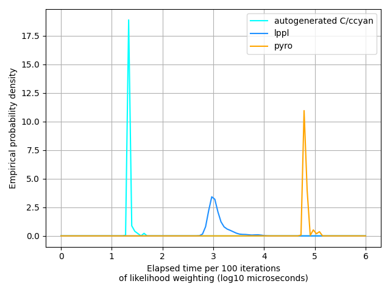

# code generation with `glppl`

`glppl` contains functionality to automatically translate graph probabilistic programs into bespoke memory-safe C99 libraries, 
enabling simulation, inference, and prediction in low-resource or real-time environments.
This is extensively documented in the [`construct_program`](https://davidrushingdewhurst.com/glppl/docs/translate_8hpp_a044bd01023d0fffbac9647dcfdb97e52.html#a044bd01023d0fffbac9647dcfdb97e52) and [`ccyan`](https://davidrushingdewhurst.com/ccyan/docs/index.html) documentation, but it's good to have an end-to-end
example of how this works. Here, we'll translate a very simple graph probabilistic program into a C library 
and use an automatically generated inference algorithm to infer the
posterior distribution over the model's latent random variables.
This entire example is available in the [`examples`](https://gitlab.com/drdewhurst/lppl-graph/-/blob/examples/build/out/my_program_main.c.bak) branch of the `ccyan`
repo. To run the example starting from the `glppl` repo, navigate to `build/out` and run `cp my_program_main.c.bak my_program_main.c && cd build && cmake .. && make && ./my_program.out`.

We'll consider an extremely simple model: a normal distribution with unknown location and scale parameter. 
We'll model the location and scale parameters as latent random variables and infer their empirical posterior distributions. 
Mathematically, we'll consider the model \\(x \sim Normal(\mu, \sigma) \\) with \\(\mu \sim Normal(0.0, 1.0) \\) and
\\(\sigma \sim Gamma(2.0, 2.0) \\).
In `glppl`, it's simple to write this down:

```c++
graph_node<Normal> normal_model(gr_pair<Normal, Gamma>& gr, double data_value) {
    auto loc = sample_g<Normal>(gr, "loc", rng)(0.0, 1.0);
    auto scale = sample_g<Gamma>(gr, "scale", rng)(2.0, 2.0);
    return observe_g<Normal>(gr, "data", data_value)(loc, scale);
}
```

You could just do inference on this model and be done with it. However, given that you're reading the code generation tutorial, you probably want to translate this
to C and do inference on the generated code.
To do this, you first populate a graph intermediate representation (a [graph_ir](https://davidrushingdewhurst.com/glppl/docs/structgraph__ir.html) -- essentially, a directed acyclic graph data structure with some additional annotations)
and then translate that graph_ir into C:

```c++
gr_pair<Normal, Gamma> gr;
auto ret = normal_model(gr, 3.0);
program_info info = { .program_name = "my_program", .inference_algo = glppl_algos::likelihood_weighting{} };
auto rep = construct_program(gr, info, "out/");
```

Here, we pretended that we observed the value `3.0` so that we had a value with which to initialize the `graph_ir`. This value doesn't actually matter;
you'll be able to post your own evidence to the model in C.
After we populated the `graph_ir`, we translated it to C and saved it in the directory `./out` (which of course you could customize; the directory will be created if it does not exist).

This program generates lots of code. You'll see two `CMakeLists.txt` files so you can build the library, and you'll see three c/h files -- `my_program.h`, `my_program.c`, and `my_program_main.c` -- essentially stubbing out an application (`my_program_main.c`) that uses the generated library.
You can feel free to delete `my_program_main.c` if you don't want an application stub.
We purposefully constructed a very small probabilistic program so we can see the entirety of the generated code -- let's take a look.
Here's all of `my_program.h`:

```c
/**
 * @file my_program.h
 * @author glppl v0.2.0 (lppl@davidrushingdewhurst.com)
 * @version 0.1.0
 * @date Sun Jan 29 20:53:32 2023
 * @copyright Copyright (c) above date - present David Rushing Dewhurst. All rights reserved except as stated in license agreement.
 */

#ifndef GENERATED_MY_PROGRAM_H
#define GENERATED_MY_PROGRAM_H

#include <ccyan_distributions.h>

struct my_program_unobserved {
  double loc;
  double loc_logprob;
  double scale;
  double scale_logprob;
};

struct my_program_observed {
  double data;
  double data_logprob;
};

struct my_program_state {
  struct my_program_unobserved unobserved;
  struct my_program_observed observed;
};

double
my_program_accumulate_logprob(struct my_program_state * state_);

double
my_program_accumulate_loglikelihood(struct my_program_state * state_);

double
my_program_accumulate_loglatent(struct my_program_state * state_);

struct my_program_state
my_program_standard(struct my_program_state state, struct rngstate * my_program_RNG);

double
my_program_score(struct my_program_state state);

struct my_program_state
my_program_predict(struct my_program_state state, struct rngstate * my_program_RNG);

void
my_program_likelihood_weighting(
  struct my_program_state state,
  struct my_program_state * empirical_posterior,
  double * weights,
  double * cum_weights,
  int num_samples,
  struct rngstate * my_program_RNG
);
#endif
```
All generated code will contain two fundamental structs, one representing the latent space of the program and the other the observed random variables -- and a struct that binds instances of the two together to represent the entirety of the state space.
Then you get a whole bunch of functions. As the code generation functionality matures, you'll probably get more, but right now there are three types:

+ Accumulation of probability from structs. These functions compute three quantities -- \\(\log p(x, z) \\) (`my_program_accumulate_logprob`),
  \\(\log p(x | z) \\) (`my_program_accumulate_loglikelihood`), and \\(\log p(z) \\) (`my_program_accumulate_loglatent`).
+ Model execution under different interpretations of the model. Right now there are three different interpretations, but in the future there will probably be more.
  1. The standard interpretation -- sampling latent random variables and scoring observed random variables against their likeilhood functiosn conditioned on the values of latent random variables, i.e., \\( (x, z) \sim f(x, z)\\) -- `my_program_standard`.
  2. The score interpretation -- given values for all latent and observed random variables, computing the joint probability of the state space under the model -- \\(\log p(x, z) | (x, z) \sim f(x, z) \\) -- `my_program_score`.
  3. The prediction interpretation -- given hypothesized values for the latent random variables, simulating possible values of the "observed" (in this case, *observable*) random variables -- \\(x \sim f(x | z) \\) -- `my_program_predict`.
+ Inference algorithms. In this case, since we passed `glppl_algos::likelihood_weighting{}` as an argument to `construct_program`, an instance of the
  likelihood weighting inference algorithm was automatically generated for us. Requesting an inference algorithm is `std::optional`; by default no inference
  algorithm will be generated for you.

There isn't much to the implementation of the `accumulate` functions -- they're just unrolled sums of probabilities from the `_logprob` fields in the relevant struct(s) -- but it's worth taking a look at the implementations of one of the model execution functions. 
Here's `my_program_standard` for our simple model:

```c
struct my_program_state
my_program_standard(struct my_program_state state, struct rngstate * my_program_RNG) {

  struct Normal loc_dist = {0.000000, 1.000000};
  double loc = sampleNormal(&loc_dist, my_program_RNG);
  state.unobserved.loc = loc;
  state.unobserved.loc_logprob = logprobNormal(&loc_dist, loc);

  struct Gamma scale_dist = {2.000000, 2.000000, (struct Normal) {0.0, 1.0}};
  double scale = sampleGamma(&scale_dist, my_program_RNG);
  state.unobserved.scale = scale;
  state.unobserved.scale_logprob = logprobGamma(&scale_dist, scale);

  double data = state.observed.data;
  struct Normal data_dist = {loc, scale};
  state.observed.data_logprob = logprobNormal(&data_dist, state.observed.data);

  return state;
}
```

It assumes that you have initialized the observed value in `state`, but the other fields can remain uninitialized.
For each latent random variable, it construct the relevant distribution, samples a value for it, computes the log probability of that value under
the distribution, and records the value and the log probability in the `unobserved` struct.
For each observed random variable, it does mostly the same thing except there's no need to generate a value, of course -- the existing value in the state
is just scored against the distribution.

The implementation of the requested inference algorithm is pretty straightforward and should be familiar to you if you have implemented a likelihood weighting
algorithm yourself:

```c
void
my_program_likelihood_weighting(
  struct my_program_state state,
  struct my_program_state * empirical_posterior,
  double * weights,
  double * cum_weights,
  int num_samples,
  struct rngstate * my_program_RNG
) {
  for (int ix = 0; ix != num_samples; ix++) {
    empirical_posterior[ix] = my_program_standard(state, &my_program_RNG);
    weights[ix] = my_program_accumulate_loglikelihood(&empirical_posterior[ix]);
  }
  double log_z = logsumexp(weights, num_samples);
  normalize_in_place(weights, num_samples, log_z);
  double_cumsum(weights, cum_weights, num_samples);
}
```

Note that this automatically generated inference algorithm uses the methods described earlier, such as the `standard` model interpretation and the
computation of the likelihood function. `logsumexp`, `normalize_in_place` and `double_cumsum` are utility functions defined as part of `ccyan`.

To help you put it all together, the translation utilities also generate you a stubbed out "main" `c` file that you can use. (Feel free to discard this if, e.g., you 
just want to use the generated models and algorithms as a modeling and inference library in other code.)
Here's what it looks like when it's first generated:

```c
/**
 * @file my_program_main.c
 * @author [Your name here]  (you@email.io)
 * @version X.Y.Z
 * @date Sun Jan 29 21:15:48 2023
 * @copyright Copyright (c) above date - present [Your name here]. All rights reserved subject to conditions in glppl license agreement.
 */

#include <my_program.h>

int main(int argc, char ** argv) {
  // your magic here...
  return 0;
}
```

We're not going to do too much to it here -- we'll pretend we observed a single data point and infer the posterior distribution \\(p(\mu, \sigma | x) \\) using
the automatically generated inference algorithm we requested. Because of the library that was created for us, this is a very easy task!

```c
/**
 * @file my_program_main.c
 * @author [Your name here]  (you@email.io)
 * @version X.Y.Z
 * @date Thu Jan 26 14:16:20 2023
 * @copyright Copyright (c) above date - present [Your name here]. All rights reserved subject to conditions in glppl license agreement.
 */

#define _USE_MATH_DEFINES

#include <ccyan_distributions.h>
#include <ccyan_util.h>
#include <my_program.h>

#include <stdio.h>

#undef NUM_SAMPLES
#define NUM_SAMPLES 100  // size of static inference buffers

// ccyan helper macros
MAKE_ARRAY_ARGMAX_FN(double)

struct rngstate RNG = {20230126ULL};  // prng
struct my_program_state empirical_posterior[NUM_SAMPLES];  // buffer for posterior samples
double weights[NUM_SAMPLES];  // log p(x, z)
double cum_weights[NUM_SAMPLES];

void print_array(double * array, int length) {
  printf("[\n");
  for (int ix = 0; ix != length; ix++) printf("  %f\n", array[ix]);
  printf("]\n");
}

void print_posterior_sample(struct my_program_state * state) {
  printf("struct my_program_state state = {\n");
  printf("  loc = %f\n", state->unobserved.loc);
  printf("  scale = %f\n", state->unobserved.scale);
  printf("}\n");
}

int main(int argc, char ** argv) {
  struct my_program_state state;
  state.observed.data = 2.513;  // we would have read this from some memory address connected to a sensor...
  my_program_likelihood_weighting(state, empirical_posterior, weights, cum_weights, NUM_SAMPLES, &RNG);  // do inference
  struct Categorical posterior = {weights, cum_weights};  // empirical posterior
  
  printf("cumulative posterior probabilities:\n");
  print_array(cum_weights, NUM_SAMPLES);

  int map_estimate = double_argmax(weights, NUM_SAMPLES);
  print_posterior_sample(&empirical_posterior[map_estimate]);

  printf("done!\n");

  return 0;
}
```

That's it.

## Comparison

It's instructive to consider two ways of solving the same inference problem that we defined above.
We just walked through one of them -- define it in `glppl`, automatically translate that to C, and then use that C library.
The other sensible way to solve this is just to use `lppl` to define your program, queryer, and inference algorithm.
For good measure, let's also compare another leading alternative -- [pyro](https://pyro.ai), a universal probabilistic programming language
embedded in python (and one of the inspirations for `lppl`!)
Here are the approaches, back to back.

### `lppl`

Model:

```c++
double normal_no_value_lppl(record_t<Normal, Gamma>& r, double data_value) {
  auto loc = sample(r, "loc", Normal(0.0, 1.0), rng);
  auto scale = sample(r, "scale", Gamma(2.0, 2.0), rng);
  return observe(r, "data", Normal(loc, scale), data_value);
}
```

Queryer and inference:

```c++
  pp_t<double, double, Normal, Gamma> f = normal_no_value_lppl;
  auto opts = inf_options_t(100);
  auto queryer = weighted_record<double, Normal, Gamma>();
  auto infer = inference<LikelihoodWeighting>(f, *queryer, opts);
  double data = 3.0;  // again, mocking up data that we would have read from a sensor, etc.

  // we'd time just this call to get a good inference algorithm comparison
  // thsi returns a full empirical posterior -- in this case, over "loc" and "scale"
  auto result = infer(data);
```

### `glppl` + translation

Model:

```c++
graph_node<Normal> normal_model(gr_pair<Normal, Gamma>& gr, double data_value) {
    auto loc = sample_g<Normal>(gr, "loc", rng)(0.0, 1.0);
    auto scale = sample_g<Gamma>(gr, "scale", rng)(2.0, 2.0);
    return observe_g<Normal>(gr, "data", data_value)(loc, scale);
}
``` 

Translation:

```c++
gr_pair<Normal, Gamma> gr;
auto ret = normal_model(gr, 3.0);
program_info info = { .program_name = "timing_test_program", .inference_algo = glppl_algos::likelihood_weighting{} };
auto rep = construct_program(gr, info, "timing_test/");
```

Inference (in C);

```c
  struct timing_test_program_state state;
  state.observed.data = 2.513;  // we would have read this from some memory address connected to a sensor...

  // this is roughly equivalent to the timed inference algorithm in lppl example
  timing_test_program_likelihood_weighting(state, empirical_posterior, weights, cum_weights, NUM_SAMPLES, &RNG);  // do inference
  struct Categorical posterior = {weights, cum_weights};  // empirical posterior
```

### `pyro`

Model:

```python
def normal_model(data: float) -> float:
    loc = pyro.sample("loc", dist.Normal(0.0, 1.0))
    scale = pyro.sample("scale", dist.Gamma(2.0, 2.0))
    return pyro.sample("data", dist.Normal(loc, scale), obs=data)
```

Inference:
```python
data = torch.tensor(3.0)
importance = pyro.infer.Importance(normal_model, guide=None, num_samples=100)
posterior = pyro.infer.EmpiricalMarginal(importance.run(data))
```

### Stacking up
We have to write pretty much the same amount of code for each of them. `pyro` makes us write the smallest amount of code, but not by much -- `lppl` is nearly as concise and (I'd argue, though I'm biased) enables you to understand what's going on in the model much more clearly.
The `glppl` translation method requires two compiles -- one in C++ and one in C, and overall is a little more verbose than the other two methods.
But the `glppl`-generated C code is much, much faster than the `lppl` method, to say nothing of `pyro`:



This isn't knocking `lppl` at all -- its algorithms are designed to do inference on literally any computable probabilistic model; it quite consciously trades off
speed for flexibility and interpretability. (It's also worth noting that `glppl` uses `lppl` underneath...)

So which method to use? As with everything software engineering-y, it depends on your higher-level objectives.
If the rest of your codebase is in python and/or you want some neural network hand-holding, then `pyro`'s for you.
(Disclaimer: I'm not affiliated with the `pyro` team in any way; it's just a good library and deserves recognition.)
Conversely, if you're trying to do inference in a real-time or resource constrained environment -- or even if you just need to do inference fairly quickly -- then using `glppl` to generate customized code for you probably's the way to go. The "middle option", `lppl`, is still orders of magnitudes faster than `pyro`, is just as expressive as `pyro`, and has no dependencies except for the C++ standard library. For most use cases `lppl` is likely the best choice.

## What's next?

Though `glppl`-generated C/`ccyan` code is fast, relatively memory efficient, and memory safe, there's definitely room for improvement.
If you look at the source of the generated code or `ccyan`, you'll notice lots of copying going on (via pass-by-value).
This is because `ccyan` promises to be memory-safe, and hence it and the `glppl`-generated code do not use `malloc`/`free`.
However, there are still probably unncessary copies due to lack of sophistication in the code generation process. 
We shouldn't necessarily have to copy an entire `state` struct if we plan to do inference over only one part of it.
Similarly, if we're using a generated `score` method with pre-computed parameter values to implement online anomaly detection, we shouldn't have to copy
the struct on every function call. Making improvements such as this would decrease runtime while still ensuring provable memory safety.
Other optimizations could focus on struct field ordering to ensure that fields frequently accessed together (e.g., `loc` and `loc_logprob`) are adjacent in the
struct to increase the likelihood they're colocated in L1 cache. Non-performance improvements will likely focus on additional autogenerated inference algorithms
(e.g., versions of metropolis-hastings, variational inference).