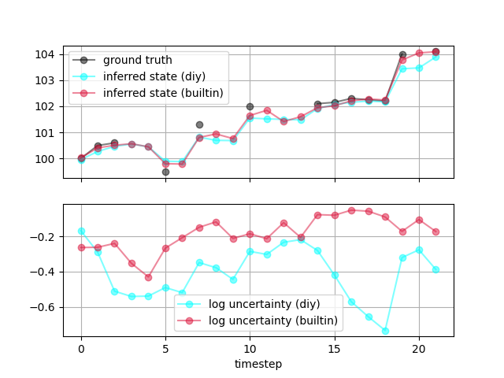

# `dynamic.cpp`

Filtering is a generic dynamic inference operation. Given a current observed state of the world \\(x_t\\), we want to infer a latent/unobserved state of the 
world \\(z_t\\). 
Using this inferred value and some knowledge of system dynamics, we might also want to solve the related task of forecasting future values
of thelatent state, \\(z_{t+s}\\).
Such tasks are common in finance (inferring latent fundamental value now and forecasting future fundamental value), 
biology (forecasting unobserved chemical concentrations given biomarker samples), and other fields. 
In the language of probabilistic modeling, we would formulate this problem as follows: given a likelihood function \\(p(x_t | z_t)\\), a prior distribution
\\(p(z_0)\\), and hypothesized transition dynamics \\(p(z_t | x_{t-1}, z_{t-1})\\), infer the following quantities: (a) the same-timestep posterior distribution
\\(p(z_t | x_t)\\); (b) the \\(s\\) step ahead forecast distribution \\(p(z_{t + s} | x_t)\\). 

You can use `lppl` probabilistic programs and inference algorithms to solve filtering problems either by using built-in functionality -- specifically, the [`Filter` class](https://davidrushingdewhurst.com/lppl/docs/structFilter.html) -- or by rolling your own filtering algorithms using more primitive inference algorithms and constructs. 
This walkthrough covers examples of each.

## Mathematical model

We'll focus on a simple hierarchical model of a univariate observation with latent location parameter. The variance of the location parameter is also unknown.
Mathematically, we are considering the model

\\[x \sim Normal(z, 0.5);\qquad z \sim Normal(100.0, \exp(\ell)); \qquad \ell \sim Normal(0.0, 0.5)\\]

For this example, we'll also assume extremely simple random walk transition dynamics, i.e., 

\\[z_t \sim Normal(z_{t-1}, \exp(\ell_{t-1}));\qquad \ell_t \sim Normal(\ell_{t-1}, 0.5) .\\]

Expressing this model in `lppl` could be done multiple ways. Here we're focusing on two -- one that'll be easy to use with built-in filtering algorithms, and another
that's designed for a custom mean-field filtering algorihm of our own design. 

## Built-in filtering

All `lppl` probabilistic programs are callables taking a `record_t<Ts...>&` as the first argument (`Ts...` are the types of distributions within the
program) and the input to the program as the second argument.
Here's an implementation of the normal model described above:
```cpp
double local_level(record_t<Normal>& r, std::optional<double> data) {
    auto log_latent_scale = sample(r, "log_latent_scale", Normal(0.0, 0.5), rng);
    auto loc = sample(r, "latent", Normal(100.0, std::exp(log_latent_scale)), rng);
    if (data.has_value()) {
        return observe(r, "observed", Normal(loc, 0.5), data.value());
    } else {
        return sample(r, "observed", Normal(loc, 0.5), rng);
    }
}
```
Note we're using `std::optional<double>` as we might or might not observe a value at a given timestep; our goal is to infer the `"latent"` value regardless of whether or not
we make an observation.
There's a static lifetime `std::minstd_rand` named `rng` in the file in which `local_level` is defined.
If we didn't want to have that static lifetime object, we could have instead refactored to pass as `data` a pointer to some struct containing a PRNG.

We need to define transition dynamics to use built-in filtering algorithms.
As we described earlier, we'll use really simple random walk transition dynamics.
We'll estimate the new value of `"latent"` as being normally distributed around the last `"latent"` value, while the new value of `"log_latent_scale"` will be
normally distributed around the last one.
Here's our transition kernel:

```cpp
struct normal_trans_kernel : transition<double, Normal> {

    double loc;
    double log_scale;
    normal_trans_kernel() : loc(100.0), log_scale(0.0) {}

    void update(FilterValueType<double, Normal>& cache) {
        loc = mean(*cache->template at<double>("latent").sample(rng, 100));
        log_scale = mean(*cache->template at<double>("log_latent_scale").sample(rng, 100));
    }

    std::pair<record_t<Normal>, double> generate() {
        record_t<Normal> r;
        auto ls = sample(r, "log_latent_scale", Normal(log_scale, 0.5), rng);
        sample(r, "latent", Normal(loc, std::exp(ls)), rng);
        return std::make_pair(r, logprob(r));
    }

};
```
Transition kernels derive from `transition<O, Ts...>` (`O` is the output type of the probabilistic program) and have to define `void update(FilterValueType<O, Ts...>&)`
and `std::pair<record_t<Ts...>, double> generate()`. `update` takes in an empirical posterior distribution \\(p(z_t | x_t)\\) (see [documentation](https://davidrushingdewhurst.com/lppl/docs/structtransition.html)) and does...something that's up to you!...to update its internal state, which can be used to parameterized the transition dynamics \\(p(z_{t+1}|x_t, z_t)\\).
`generate` actually constructs those transition dynamics and returns a record sampled from this distribution. 
Computing the updates to `loc` and `log_scale` do exactly what we outlined above. 
(The Monte Carlo mean of `log_scale` is due to laziness, not inability to compute the exact enumerated weighted mean; for the exact mean, use [`prob_at`](https://davidrushingdewhurst.com/lppl/docs/structvalue__collection__t_aca6a6411f3531c3ac55ef3b0e702e1e3.html#aca6a6411f3531c3ac55ef3b0e702e1e3) to get the posterior log probability of each record, then grab the value from the `"log_latent_scale"` site in each record and compute the weighted sum.)

Now that we have our model and transition dynamics, we can filter. 
This is as easy as telling `lppl` what inference algorithm you want to use to compute the posterior distribution \\(p(z_t|x_t)\\) and
passing the model, transition dynamics, and queryer to the filter:

```cpp
auto q = weighted_record<double, Normal>();
auto trans = normal_trans_kernel();
auto opts = inf_options_t(200);
auto infer = filter<LikelihoodWeighting>(f, *q, trans, opts);

for (auto& value : time_series) {  // or message from kafka topic, etc.
    auto res = infer.step(value);
    // ... do other stuff
}
```
Because we parameterized `Filter` with `LikelihoodWeighting`, this filtering algorithm corresponds to a classic particle filter with renewal at each step.
Internally, the created `Filter` instance uses the initial prior \\(p(z_0)\\) to compute the proposals at the first call to `step` and subsequently uses
\\(p(z_t | z_{t-1}, z_{t-1})\\). The weight assigned to each record comes from `LikelihoodWeighting`, or `loglikelihood(r)` i.e. \\(p(x_t | z_t)\\).

In the full [demo code](https://gitlab.com/drdewhurst/lppl-examples/-/blob/master/src/dynamic.cpp), you'll see that the "other stuff" here is just extracting the values
we want -- the mean values of `"latent"` and `"log_latent_scale"` -- out of the query result and returning the collected values.

## DIY filtering

Of course, you can be obstinate and not use the built-in algorithms. 
Maybe you dislike the forced usage of `WeightedRecord` queryer (which uses \\(O(n\_samples)\\) memory), or maybe you want to roll your own update logic.
Let's rewrite the model to eschew `transition` and `Filter` in favor of lower-level inference and query machinery:

```cpp
struct data_t {
        std::optional<double> data;
        std::optional<double> prev;
        double log_latent_scale;

        data_t(double d) 
            : data(d), prev(std::nullopt), log_latent_scale(0.0) {}
    };

double local_level(record_t<Normal>& r, std::shared_ptr<data_t> state) {
    auto log_latent_scale = sample(r, "log_latent_scale", Normal(state->log_latent_scale, 0.5), rng);
    auto loc = sample(
        r,
        "latent",
        Normal(state->prev.has_value() ? state->prev.value() : 0.0, std::exp(log_latent_scale)),
        rng
    );
    if (state->data.has_value()) {
        return observe(
            r,
            "observed",
            Normal(loc, 0.5),
            state->data.value()
        );
    } else {
        return sample(
            r,
            "observed",
            Normal(loc, 0.5),
            rng
        );
    }
    }
```
Instead of carrying around transition dynamics inside of a `transition` instance, we've defined our own state struct that we'll later use to make updates.
Other than that, the model logic is pretty much identical.
However, the inference logic is a little more complicated -- because we're not defining a transition kernel, we need to compute the updated parameter estimates ourselves
in each filtering step:

```cpp
auto opts = inf_options_t(200);
auto data = std::make_shared<data_t>(time_series[0].value());
// mock the previous value for a decent starting point
data->prev = time_series[0].value();

// roll-ur-own filtering with mean-field updates
size_t ix = 0;
for (auto& value : time_series) {
    // mildly inefficient -- we should just have a .clear() method to reset it!
    data->data = value;
    auto q = QueryerCollection<double, double, WeightedMean, Normal>({
        "log_latent_scale",
        "latent"
    });
    auto infer = inference<LikelihoodWeighting>(f, q, opts);
    auto post_means = infer(data);
    // ... other stuff
    // update the structure with mean-field estimates
    data->prev = post_means->operator[]("latent");
    data->log_latent_scale = post_means->operator[]("log_latent_scale");
    ++ix;
}
```
We used a `WeightedMean` queryer to compute the marginal posteriors \\(p(z_t|x_t)\\) and \\(p(\ell_t | x_t)\\) which we then use to directly update
these estimates for use in the next filtering step. 

## Stacking up

Here are the results of inference on a (meaningless, fake) dataset with 22 timesteps and observations for about half of the number of timesteps:


As we would hope, the posterior mean `"latent"` is almost identical across algorithms. 
However, the DIY filtering algorithm estimates substantially lower variance in the latent location parameters over time intervals dense with observations.
(Whether or not this matters in practice depends on how risk-averse you are.)
As far as performance goes, the DIY algorithm will use less memory (thanks to its usage of `QueryerCollection` over `WeightedRecord`) and is also faster on average:
```
Average time per DIY filter iteration = 1895.14us
Average time per built-in filter iteration = 5973.23us
```
But the DIY implementation also requires more effort to understand and doesn't scale to more complex models.
(Also, speed and memory usage are all relative -- the entire executable takes about 0.18s to run and requires 2.24MB RAM on a 2019 MBP.)
Such tradeoffs are yours to make -- `lppl` provides both low- and high-level tools for you to use as you see fit.

### License etc.

`lppl-examples` is licensed under GPL v3. If you would like a license exception please contact us at [lppl@davidrushingdewhurst.com](mailto:lppl@davidrushingdewhurst.com). Copyright David Rushing Dewhurst, 2022 - present.