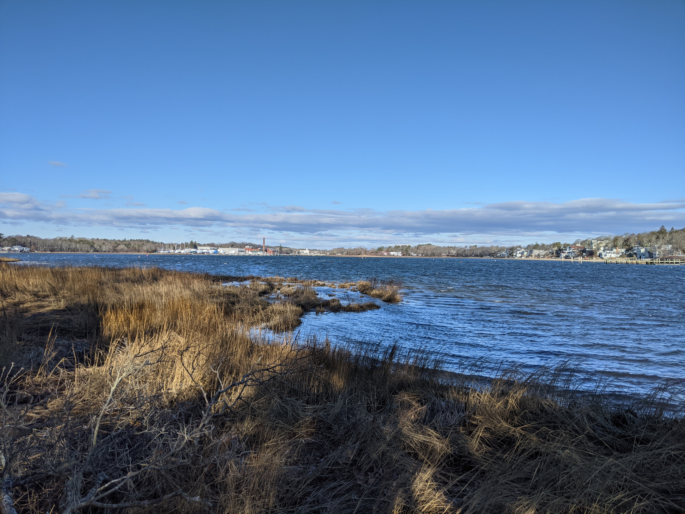
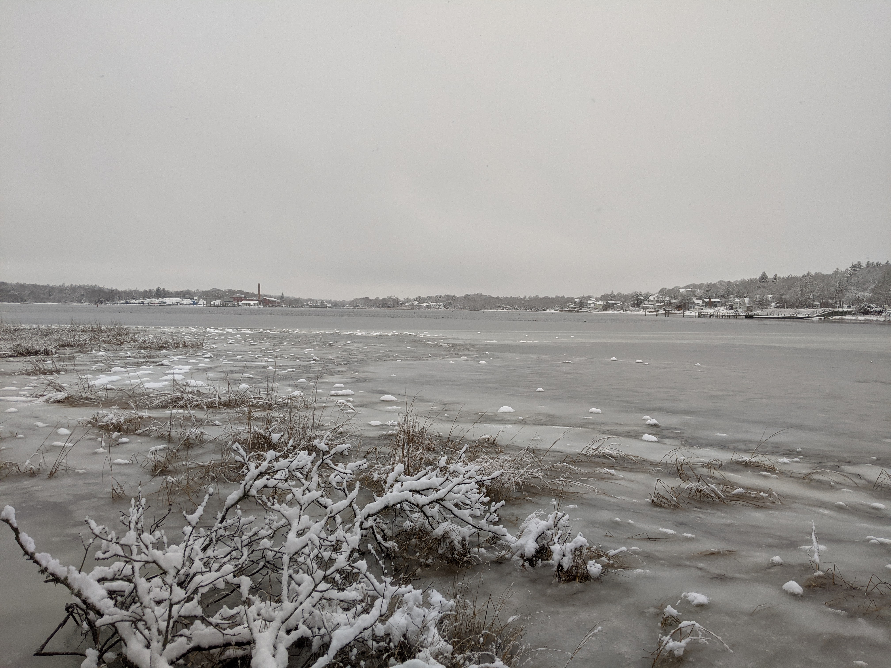

#### Personal

My family and I live in a town called Wareham on the south coast of Massachusetts. 
It's a wonderful area that's less commonly-trafficked than the cape, at least by outsiders, and has a culture that I think is 
significantly different from much of the rest of the state. My house was built in 1920, old enough for the walls to be constructed from 
2x3s, not 2x4s. 

  
   
  

This is the view from my backyard at two different times of year -- October on the top, January in the middle, and January in the snow on the bottom.

I met my wife, Casey Lyn Dewhurst (nee Comeau), in 2011. 
She is an extraordinarily talented artist, gardener, crafter, baker, and beekeeper (or apiarist, if we're being fancy). She has beehives in three towns across southeastern Massachusetts and harvests delicious honey.

This is a bee that landed on my wife's finger. I am not fond of such events, but she doens't seem to care.

We have two sons: our first, Jacob Alexander Conrad Dewhurst, was born in 2020;
our second, Colin Glenn Stephen Dewhurst, was born in 2021. They are good boys. Because they are kids, they are also very weird.

I used to have hobbies. Now I work and parent.
